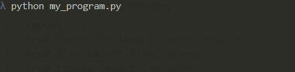

# Preload

Python programs often seem to "hang" in the beginning. This is due to
heavy modules being imported. This package lets the user now what is
happening, to avoid this impression:




## Usage

```python
from preload import preload_with_feedback
preload_with_feedback(["matplotlib.pyplot", "scipy.signal"])

# [Rest of your code, such as: ]
import numpy as np
import scipy.signal
import matplotlib.pyplot as plt

print("Hello")
```

## Installation

```
pip install preload
```
